# Exploratory Data Analysis (EDA)

EDA is the process of exploring your data to understand its structure, patterns, and quality before building models or making business decisions. It's essentially "getting to know" your data.

Key tools used in EDA include histograms, box plots, and correlation matrices — all used to visualize how features relate to each other and to the target variable.

A major benefit of EDA is outlier detection. Box plots and the Interquartile Range (IQR) method are common ways to identify unrealistic values that may need handling.

## Questions EDA Answers

1. **Is the data clean?** — Are there missing values, duplicates, or inconsistent formats?
2. **Are there patterns?** — Does the data show any recurring trends or behaviors?
3. **Are variables related?** — Do features correlate with each other or with the target?
4. **Are there outliers?** — Are there extreme values that could distort analysis?
5. **Is the target variable balanced?** — For classification, are classes evenly distributed?
6. **Are assumptions broken?** — Do statistical assumptions (like normality) hold?

---

# Data Visualization Guide

## 1. Histogram — Distribution of a Variable

Histograms show how values are distributed across different ranges. They're used to understand:

- **Spread** — How wide is the range of values?
- **Normality** — Does the data follow a normal (bell curve) distribution?
- **Skewness** — Is the data asymmetric?
- **Weird spikes** — Are there unexpected peaks that warrant investigation?

 
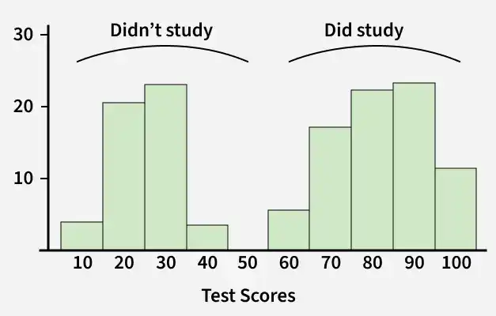
 

### Normal Distribution (Bell Curve)

A bell-shaped distribution indicates data is normally distributed — ideal for many statistical models.

 
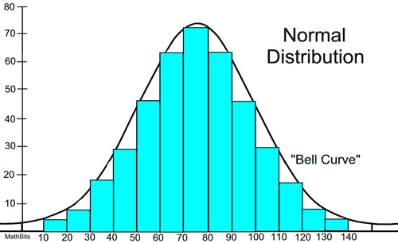
 

*Source: [MathBits Notebook](https://mathbitsnotebook.com/Algebra2/Statistics/STnormalDistribution.html)*

### Skewness

Skewness measures the asymmetry of a distribution:

- **Right-skewed (positive)** — Tail extends to the right; most values are small with a few large outliers.
- **Left-skewed (negative)** — Tail extends to the left; most values are large with a few small outliers.

 
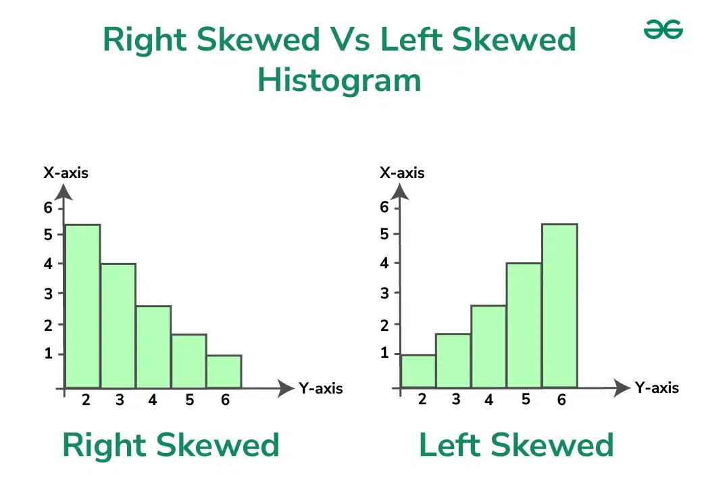
 

---

## 2. Box Plot — Outlier Detection

Box plots provide a quick visual summary and are particularly useful for identifying outliers. The box represents the interquartile range (IQR) — the middle 50% of the data — while the whiskers show the acceptable range. Any points beyond the whiskers are considered outliers.

Key components:
- **Median** — The middle value.
- **IQR** — The range between the 25th and 75th percentiles.
- **Whiskers** — Typically extend to 1.5× IQR from the quartiles.
- **Outliers** — Points beyond the whiskers.

 
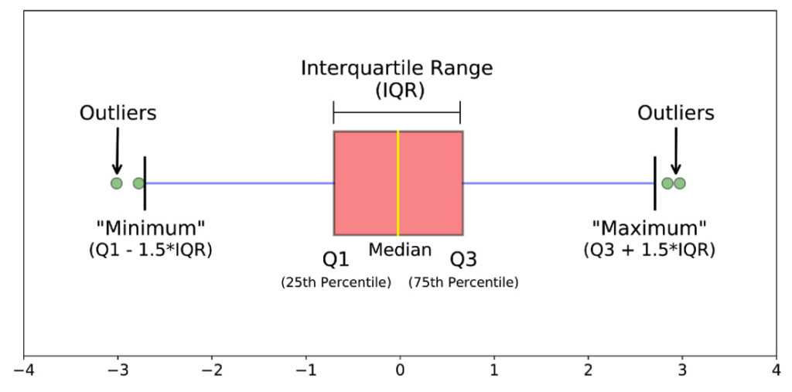
 

---

## 3. Scatter Plot — Relationship Between Variables

Scatter plots display values for two variables as points on a Cartesian plane. They're one of the most powerful EDA tools for uncovering relationships.

Used to identify:
- **Correlation** — Do variables move together (positive or negative)?

 
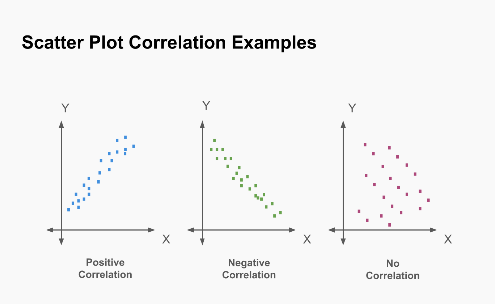
 

- **Clusters** — Are there natural groupings in the data?
- **Nonlinear relationships** — Do variables have curved or exponential relationships?
- **Separability** — Can classes be separated visually in classification problems?

 
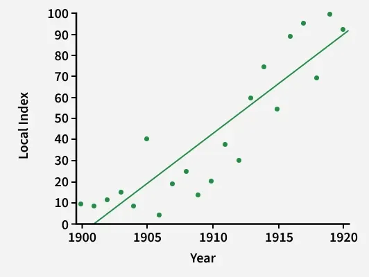
 

---

## 4. Correlation Heatmap — Feature Relationships

Extremely common in Machine Learning notebooks, heatmaps visualize the correlation matrix of your dataset. 

**Correlation Matrix scale:**
* **+1** → Strong positive relationship
* **-1** → Strong negative relationship
* **0** → Unrelated

 
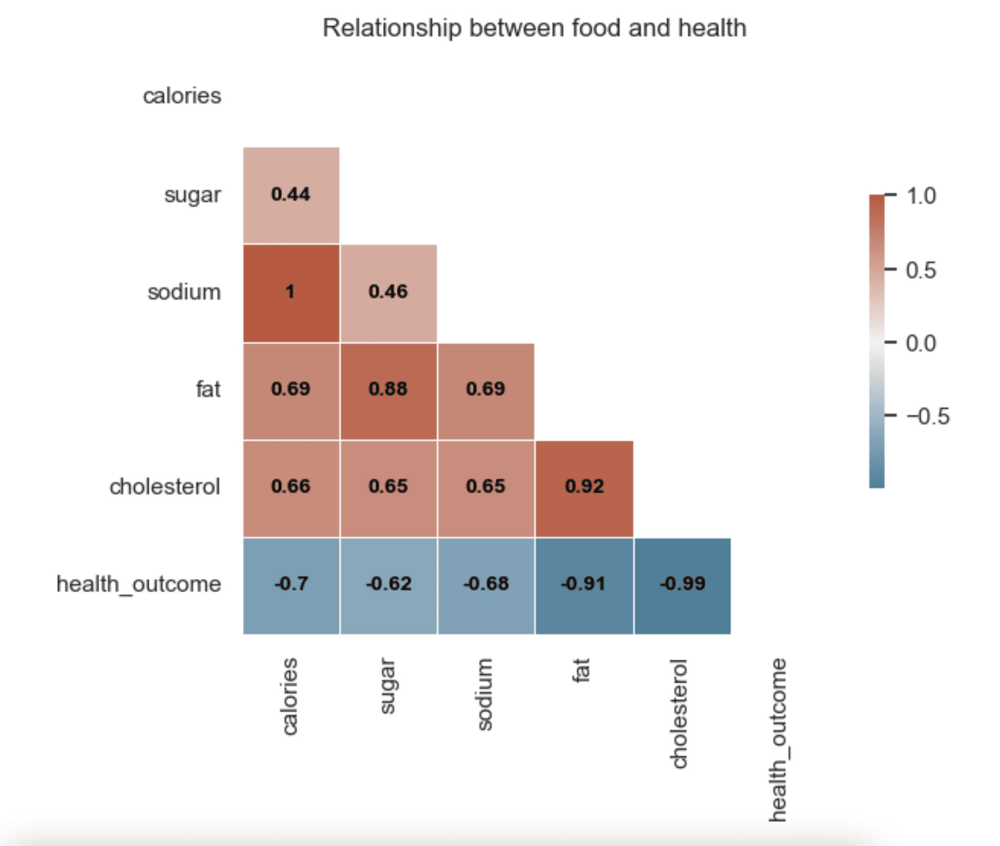
 

*Source: [Read for better understanding](https://www.quanthub.com/how-to-read-a-correlation-heatmap/)*

**Machine Learning Relevance:**
Highly correlated features are important to identify because they can add redundancy, hurt model interpretability, and cause mathematical instability in linear regression models (multicollinearity). 

*Commonly built using Seaborn (`sns.heatmap`) and Pandas (`df.corr()`).*

---

## 5. Pair Plot — Quick Full Dataset Exploration

A pair plot draws scatter plots between every single pair of features in your dataset, with histograms (or KDEs) on the diagonal to show individual distributions.

 
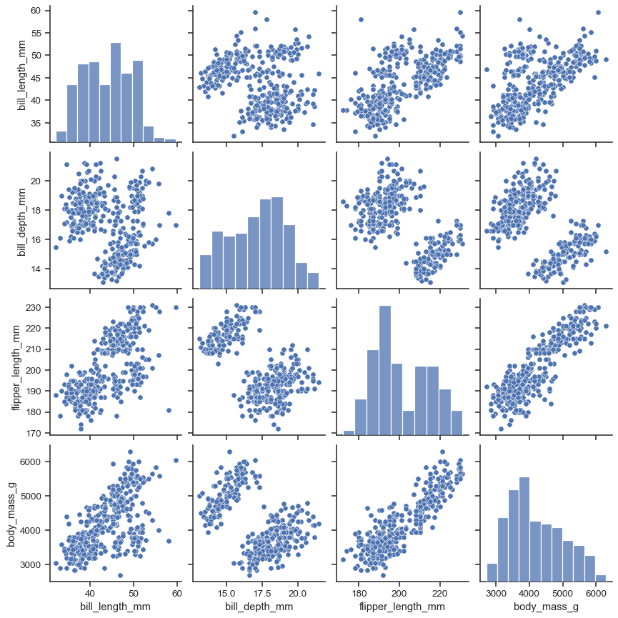
 

*Source: [Read for better understanding [Seaborn Docs]](https://seaborn.pydata.org/generated/seaborn.pairplot.html)*

**Best for:**
* Beginner EDA.
* Detecting patterns and relationships very quickly.
* Seeing class separation (e.g., The famous Iris Dataset looks beautiful in pair plots because the flower classes separate nicely).

**Downside:** Terrible for large datasets with high feature counts, as it becomes visually overwhelming and computationally expensive to render.

---

## 6. Count Plot / Bar Plot — Categorical Understanding

Used specifically for categorical variables to understand class balance and category frequency. 

 
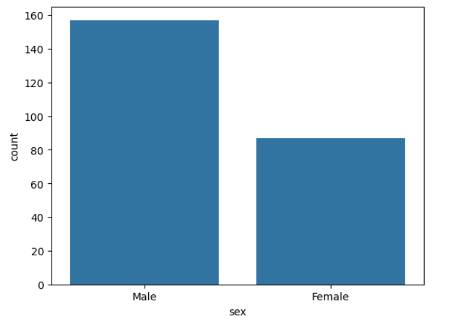
 

**Examples:**
* Fraud vs. Non-fraud transactions.
* Demographic counts (e.g., Male vs. Female).
* Product category popularity.

**Machine Learning Relevance:** Identifying class imbalance is a massive part of EDA. If your dataset is 99% non-fraud and 1% fraud, your model may "cheat" by simply predicting *everything* as non-fraud to achieve 99% accuracy while entirely missing the actual fraud cases.

---

## 7. KDE Plot (Density Plot) — Smooth Distributions

A Kernel Density Estimate (KDE) plot is essentially a smoother version of a histogram. 

 
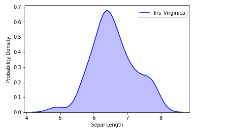
 

**Used for:**
* Understanding the continuous probability density curve.
* Comparing distributions beautifully across different classes (e.g., plotting the income distribution for "buyers" vs. "non-buyers" on the same graph).

---

## 8. Violin Plot — Distribution and Spread

A violin plot is a hybrid visualization combining the best of both a **Box Plot** and a **KDE Plot**. 

 
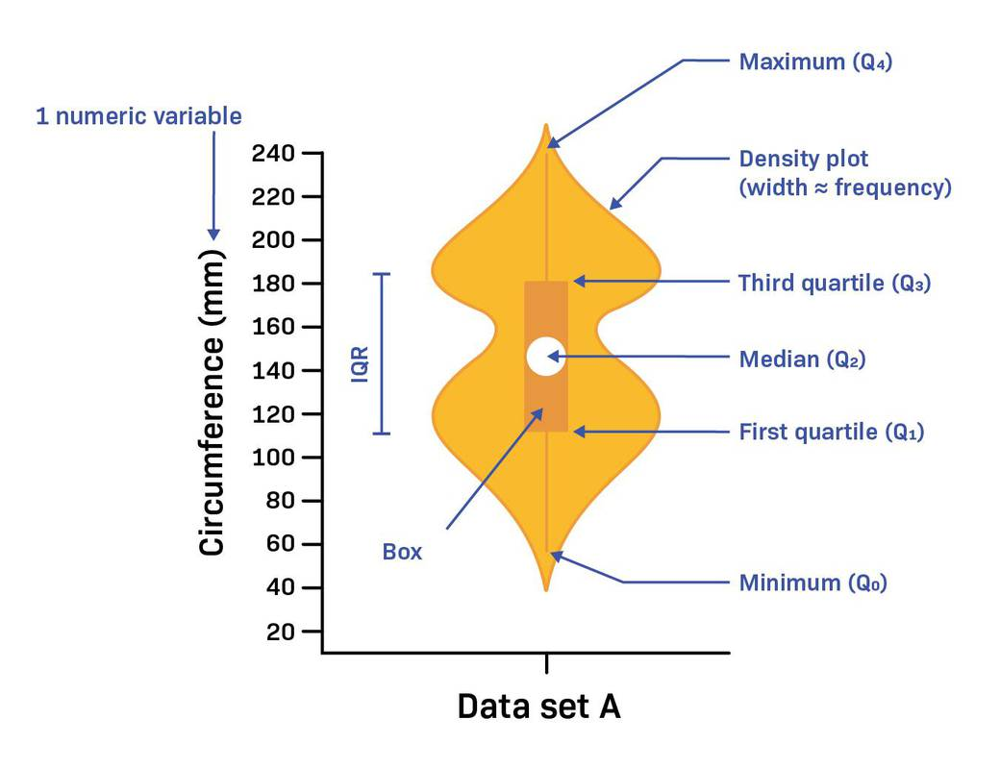
 

**Used for:**
* Viewing the distribution shape (the "swelling" of the violin) and the spread/outliers (the inner box plot markings) at the exact same time.
* Very common in academic research papers and advanced EDA notebooks.

---

## 9. Line Plot — Time Series

Line plots are the gold standard when your data changes over time.

 
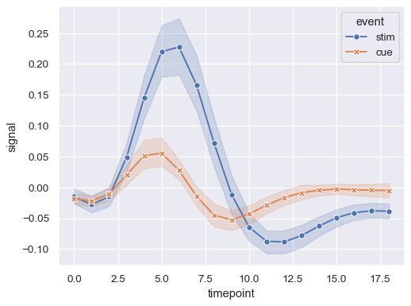
 

**Examples:**
* Stock prices.
* IoT sensor readings.
* Website traffic metrics.

**Machine Learning Relevance:**
Essential for forecasting models to help detect overarching **trends** (is it going up or down over time?), **seasonality** (does it spike every December?), **cycles**, and data **drift**.

---

## Choosing the Right Plot

| Goal | Recommended Plot |
| :--- | :--- |
| **Understand single variable distribution** | Histogram, KDE Plot |
| **Detect outliers & spread** | Box Plot, Violin Plot |
| **Explore relationships between two variables** | Scatter Plot |
| **Explore all feature relationships at once** | Pair Plot |
| **Analyze collinearity & correlations** | Correlation Heatmap |
| **Understand category frequencies & imbalance** | Count Plot / Bar Plot |
| **Compare distributions across categories** | Side-by-side Box/Violin plots |
| **Track data changes over time** | Line Plot |