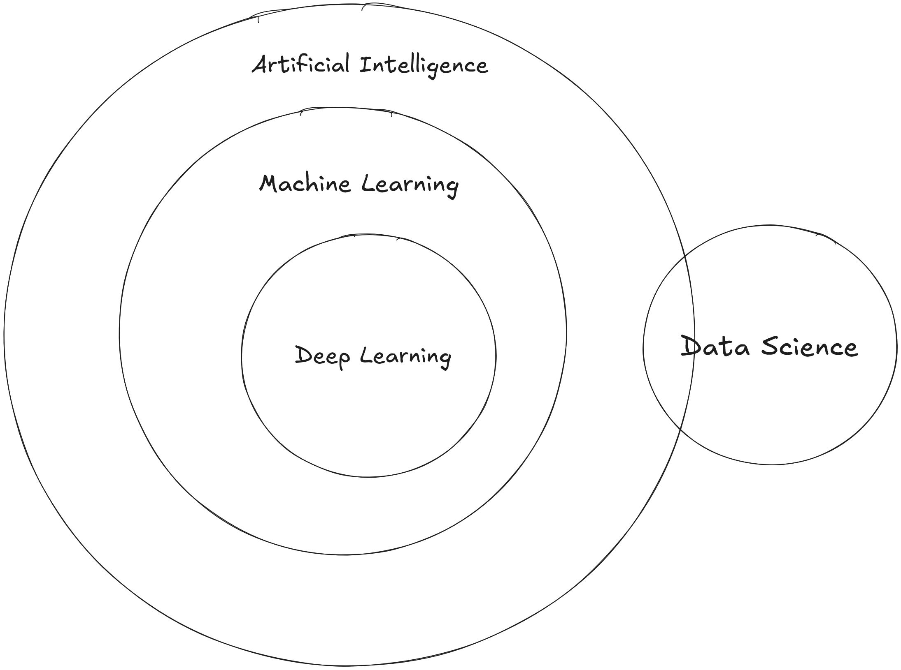

# What Is Machine Learning
### To answer this question we can take an example of an human child
When a human child is born it doesn't have a memory or doesn't know what to do it learns slowly year by year by seeing things, feeling things and expericining things. 

Now here's the thing, A human child growing up eventually learns how to recognise certain stuff, Let's say in this case it's a dog, how does it know what is a dog and how did you come to the conclusion that it is a dog

Here's how:

We show the child pictures of a dog, a real life example of dog multiple times and telling is that "This is a dog" and eventually the child learns the patterns of how a dog looks like and labels it as "dog" in his memory so if you show it a picture of a dog that he hasn't seen before it'll recognise it labelling it as a dog from the patterns it had learn and the past experience.

Machine learning is the same, but in this case instead of a child it's a computer, In machine learning we teach a computer to learn from experience and data rather than explicitly pgorammer for every task. 

Similar to how a child learns a dog by seeing many examples, a computer studies huge amount of data to recognise patterns and make predictions

For a machine to recognise a dog we would need to provide it dataset with the pictures of dog and it'll identify certain patterns like edges and textures, 

- eyes (The shape, location and spots), 
- ears (Postion, floppy pointed), 
- paws(the shape of the paws)
- tail: the presence and shape of the tail
- body posture
-facial geometry (Arrangement of each part like eyes ears and snouth)

Machine learning is a subset of AI so we can say that whatever machine learning application you create can be called an AI application

Umbrella Diagram:

Later on we divide machine learning into 3 parts:

1. Supervised Learning: 
 Teaching a computer to recognise things with independent and dependent features by using labelled data.

     a. Regression  
     ddd
     
     b. Classification 